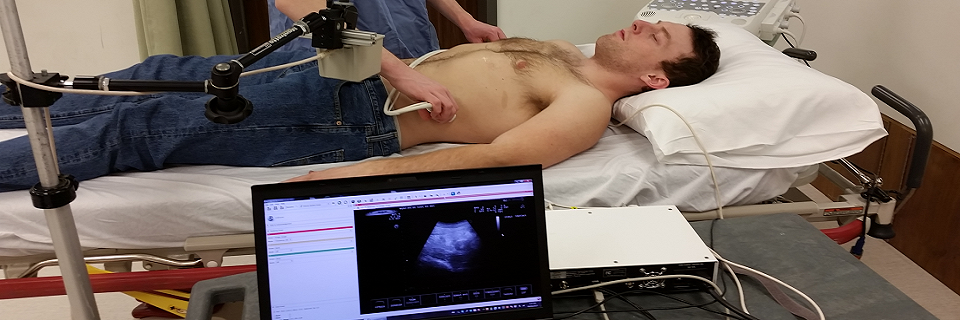
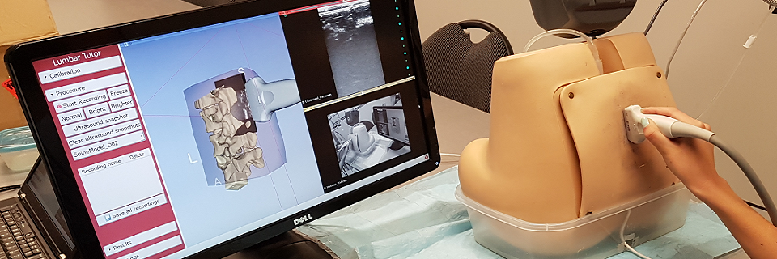
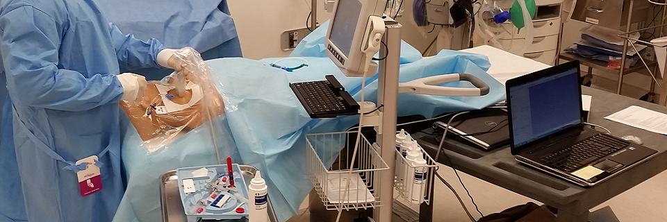
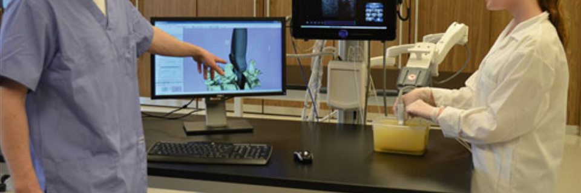

# Example Applications of Perk Tutor

## [Objective Technical Proficiency Assessment in Ultrasound-Guided Lumpectomy ](Lumpectomy.html)
 

## [Holographically Augmented Training for Suturing ](HoloSuture.html)
 

## [Automated Instruction and Feedback for Central Line Training ](CentralLineTutor.html)
 

## [Assessing Technical Proficiency in Simulated Colonoscopy ](Colonoscopy.html)
 

## [Training for Ultrasound-Guided Needle Insertion Using 3D Visualization ](UsNeedle.html)
 

## [Objective Evaluation of Sonographic Skill in FAST Examinations ](FastUltrasound.html)
 

## [Computerized Training for Ultrasound-Guided Lumbar Punctures ](LumbarPuncture.html)
 

## [Improving Ultrasound-Guided Nephrostomy in Trainees Using Tracked Snapshots ](Nephrostomy.html)
 

## [Hand and Instrument Motion Analysis to Evaluate Competency in Central Line Catheterization ](CentralLineHMA.html)
 

## [Ultrasound-guided Facet Joint Injection Training ](FacetJoint.html)
 