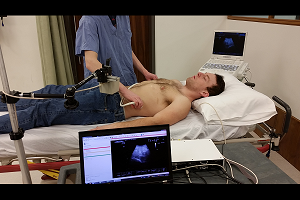
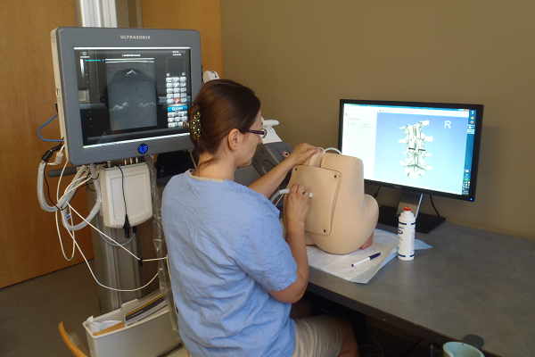
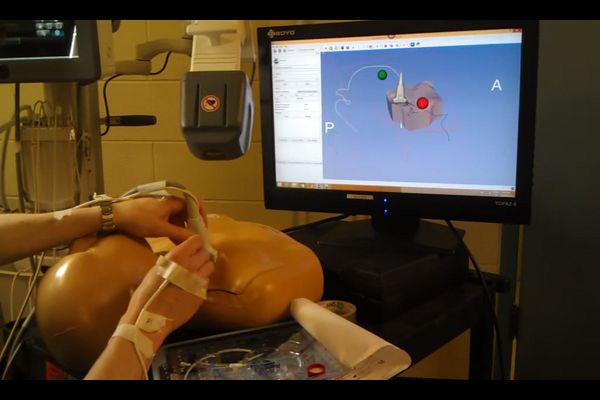
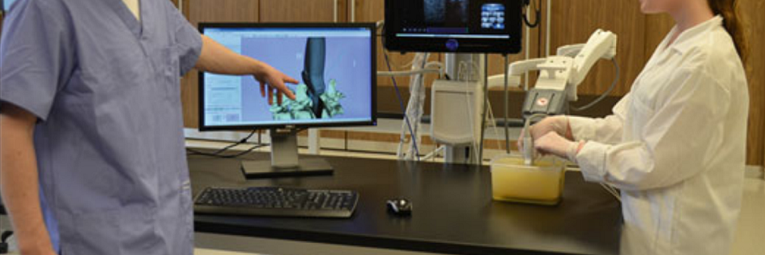

# Example Applications of the PerkTutor

|  |  |
| -- | -- |
|  | [Objective Evaluation of Sonographic Skill in FAST Examinations](FastUltrasound.html) |
|  | [Computerized Training for Ultrasound-Guided Lumbar Punctures](LumbarPuncture.html) |
|  | [Hand Motion Analysis to Evaluate Competency in Central Line Catheterization](CentralLine.html) |
|  | [Ultrasound-guided Facet Joint Injection Training](FacetJoint.html) |