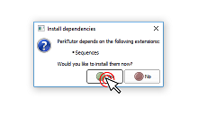

# Download and Install Perk Tutor

1. Download and install [3D Slicer](http://download.slicer.org) (available for Windows, Mac, Linux).
1. Install Perk Tutor from 3D Slicer extension manager.

# Tutorials

These tutorials demonstrate how to use Perk Tutor for your computer-assisted training application. While these tutorials can be completed with no prior experience, it is recommended to complete the [3D Slicer Tutorials](https://www.slicer.org/wiki/Documentation/4.8/Training) and [SlicerIGT Tutorials](http://www.slicerigt.org/wp/user-tutorial/) beforehand.

Download the complete Perk Tutor tutorial dataset: [Complete Dataset](https://drive.google.com/open?id=1hgtEJTfWnwHBufYJt7326gcyBYvELOG5)

Download the dataset for live tutorials: [Live Dataset](https://drive.google.com/open?id=1YaLxw2CBB2HZ7_SFQdTwkQSt-GmBFt71)

---

### [Introduction](https://drive.google.com/open?id=1bQJxcbnYVCFKXImJ4dydWf9GBHAy4aUg)

**Pre-requisites**: None

**Description**: An introduction explaining how to install and set up Perk Tutor

### [Data Recording](https://drive.google.com/open?id=1Vhw2wifhCCmpuzms4ioxh4cMGFehIUNq)

**Pre-requisites**: Introduction

**Description**: Recording and annotating both tracking data and imaging data with Perk Tutor

### [Skills Assessment](https://drive.google.com/open?id=1_GMkAgF94uNQoDPRpAZZTzEGQRqp8xcC)

**Pre-Requisites**: Introduction, Data Recording

**Description**: Computing primitive measures of skill and overall measures of technical proficiency in interventions with Perk Tutor

### [Workflow Analysis](https://drive.google.com/open?id=15Iy2JImIVrw048iBIg2UnTnfapMCMCWi)

**Pre-Requisites**: Introduction, Data Recording

**Description**: Automatically providing real-time instruction to trainees performing interventions with Perk Tutor

---

Other guides and tutorials are available: [Perk Tutor Tutorials & Guides](https://github.com/PerkTutor/PerkTutor/wiki/Tutorials)

# Contact Us

[Contact](https://github.com/PerkTutor/PerkTutor/wiki/Contact)