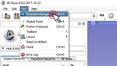

# Download and Install Perk Tutor

1. Download and install [3D Slicer](http://download.slicer.org) (available for Windows, Mac, Linux).
1. Install Perk Tutor from 3D Slicer extension manager.

# Tutorials

[Perk Tutor Tutorials](https://github.com/PerkTutor/PerkTutor/wiki/PerkTutor-Tutorials).

# Module Tutorials

* [Perk Evaluator](https://github.com/PerkTutor/PerkEvaluator/wiki/Tutorials)
* [Transform Recorder](https://github.com/PerkTutor/TransformRecorder/wiki/Tutorials)
* [Workflow Segmentation](https://github.com/PerkTutor/WorkflowSegmentation/wiki/Tutorials)

# Contact

[Contact](https://github.com/PerkTutor/PerkTutor/wiki/Contact)